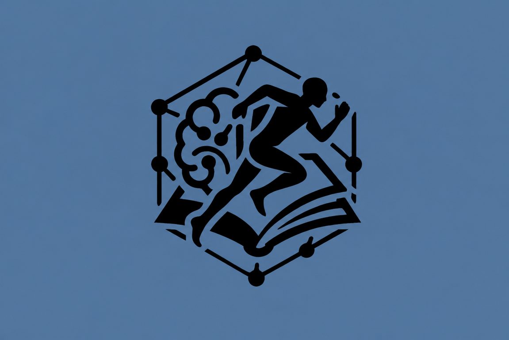

<div align="center">



# EdUnity

**Studia meglio con l'AI — gratis, per tutti gli studenti**

[](https://doublef35.github.io/EdUnity/)
[](https://www.liceogalileoferraris.edu.it/)
[](#licenza)

> Registra la lezione · Trascrivi con AI · Ottieni riassunti, flashcard e quiz in secondi

</div>

---

## 🚀 Cos'è EdUnity

EdUnity è una **web app gratuita** nata a Torino da 5 studenti del Liceo Scientifico *Galileo Ferraris*. Abbiamo cercato uno strumento che trasformasse le nostre registrazioni e i nostri appunti in materiale di studio pronto all'uso — non lo abbiamo trovato, quindi l'abbiamo costruito noi.

Pensata per **tutti gli studenti**, con attenzione speciale per chi ha **DSA** e per gli **studenti-atleti** che hanno poco tempo.

---

## ✨ Funzionalità

| Funzione | Descrizione |
|---|---|
| 🎙 **Registrazione ibrida** | Preview live con Web Speech + trascrizione finale Whisper AI per massima precisione |
| 📝 **Riassunto** | Veloce (5 punti) o dettagliato con titoli |
| 🃏 **Flashcard** | Generate automaticamente in formato Domanda/Risposta |
| ❓ **Quiz interattivo** | Domande a scelta multipla con correzione immediata e punteggio |
| 🗺 **Mappa concettuale** | Struttura gerarchica o radiale dei concetti chiave |
| ✨ **Semplifica** | Riscrittura per DSA, per bambini, o in elenchi |
| 📖 **Glossario** | Estrazione automatica dei termini difficili |
| 🌍 **Traduci** | In inglese, francese, spagnolo o tedesco |
| 🧠 **Ragiona** | Tutor AI socratico che ti interroga sul testo |
| 📎 **PDF & Immagini** | Carica PDF o foto degli appunti — il testo viene estratto automaticamente |
| ☁️ **Archivio cloud** | Salva le lezioni su Firebase, accessibili da qualsiasi dispositivo |
| 🍅 **Timer Pomodoro** | Con streak giornaliera, record personale e classifica globale |
| 🔔 **Notifiche** | Avviso browser quando il pomodoro finisce, anche con la pagina in background |

---

## 📸 Screenshot

<div align="center">
<em>Aggiungi screenshot della tua app qui — trascina le immagini direttamente nell'editor GitHub</em>
</div>

---

## 🛠 Stack tecnico

- **Frontend** — HTML, CSS, JavaScript vanilla (zero framework, zero build step)
- **Font** — [Plus Jakarta Sans](https://fonts.google.com/specimen/Plus+Jakarta+Sans)
- **AI Trascrizione** — Whisper Large v3 Turbo (via Cloudflare Worker)
- **AI Testo** — LLaMA 3.3 70B Versatile (via Groq API)
- **AI Visione** — LLaMA 4 Scout (analisi immagini)
- **Auth & Database** — Firebase Auth + Firestore + Realtime Database
- **Hosting** — GitHub Pages
- **PDF** — PDF.js

---

## 🏗 Struttura del progetto

```
EdUnity/
├── index.html        # Tutta l'app (single-file PWA)
├── logo.png          # Logo app
├── icon-192.png      # Icona per installazione mobile
├── sitemap.xml       # SEO
└── README.md
```

---

## ⚡ Come usarla

Non serve installare nulla. Apri il browser e vai su:

**[edunityedu.it)**

Per installarla come app sul telefono:
- **Android (Chrome)** → menu `⋮` → *Aggiungi alla schermata Home*
- **iPhone (Safari)** → tasto `📤 Condividi` → *Aggiungi alla schermata Home*

---

## 👥 Il team

Siamo 5 studenti del terzo anno del **Liceo Scientifico Galileo Ferraris** di Torino.

| Nome | Ruolo |
|---|---|
| 🧑‍💻 Federico Fassio | Co-founder · Dev |
| 🧑‍💻 Luca Francesco Rollino | Co-founder · Dev |
| 🧑‍💻 Giovanni Mario Peiretti | Co-founder · Dev |
| 👩‍💻 Giulia Scibetta | Co-founder · Dev |
| 🧑‍💻 Simone Roero | Co-founder · Dev |

---

## 🔒 Privacy

EdUnity è pensata per **uso personale** — registra la tua voce mentre ripeti i tuoi appunti, non le lezioni in classe o conversazioni di terzi.

I dati raccolti (email, nome, lezioni salvate volontariamente) sono conservati su Firebase (Google Cloud, Europa) e non vengono mai venduti né condivisi a fini pubblicitari. I contenuti audio vengono elaborati per la trascrizione e non conservati.

Per dettagli completi → sezione Privacy nell'app.

---

## 📬 Contatti

📧 [edunity.edu@gmail.com](mailto:edunity.edu@gmail.com)

---

## 📄 Licenza

Questo progetto è rilasciato sotto licenza **MIT** — libero da usare, modificare e distribuire con attribuzione.

---

<div align="center">

Fatto con ❤️ a Torino · Liceo Galileo Ferraris · 2025

</div>
